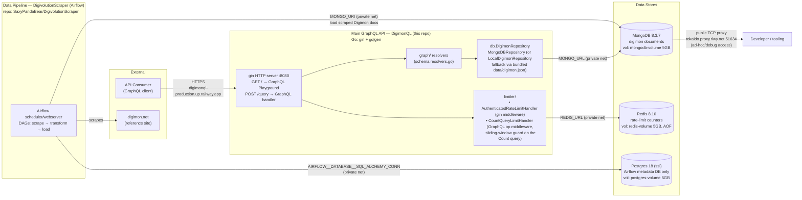

# Architecture

Infrastructure is hosted on [Railway](https://railway.com/), project `DigimonQL`, single `production` environment (region `us-east4-eqdc4a`).

## Components

| Service | Role | Key detail |
|---|---|---|
| **DigimonQL** | Main GraphQL API | Go, `gin` + `gqlgen`. Public domain `digimonql-production.up.railway.app:8080`. Exposes `POST /query` and `GET /` (Playground). Connects to Mongo (`MONGO_URL`) and Redis (`REDIS_URL`). If `MONGO_URL` is unset it falls back to the bundled static `data/digimon.json` via `LocalDigimonRepository` — a local-dev/offline mode, not used in production since Mongo is configured. |
| **DigivolutionScraper** | Data pipeline | Separate repo, runs **Apache Airflow** (`AIRFLOW__CORE__*` vars) to orchestrate scraping [digimon.net](https://digimon.net/reference_en/) and loading results into MongoDB (`MONGO_URI`). This is the production analog of the `scraper/scrape.py` script checked into this repo (which only writes a local JSON file for dev use — see [Scraping the data](./README.md#scraping-the-data)). |
| **MongoDB** | Primary datastore | Holds the Digimon documents (name, level, type, attribute, moves, digivolution chains). Written by the scraper pipeline, read by the API. Also has a public TCP proxy for manual/dev inspection, outside of app traffic. |
| **Redis** | Rate-limiting store | Backs two layers in the API: a per-client bearer-token-aware limiter (`AuthenticatedRateLimitHandler`, gin middleware) and a sliding-window global limiter specifically on the expensive GraphQL `Count` operation (`CountQueryLimitHandler`). Private network only. |
| **Postgres** | Airflow metadata DB | Consumed **only** by DigivolutionScraper (`AIRFLOW__DATABASE__SQL_ALCHEMY_CONN`) as Airflow's internal scheduler/task-state store. The GraphQL API has no Postgres connection at all. Private network only, no public domain. |

All inter-service traffic uses Railway's private network (`*.railway.internal`, resolved via each service's private network endpoint: `digimonql`, `digivolutionscraper`, `mongodb`, `redis`, `postgres`), except the two public entry points: the DigimonQL API domain and Mongo's debug TCP proxy.
