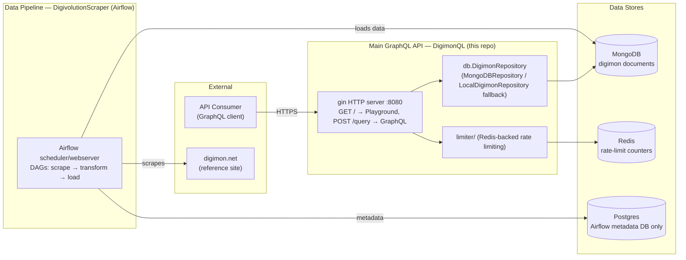

# DigimonQL

[](https://github.com/SaxyPandaBear/DigimonQL/actions/workflows/ci.yaml)
[](https://github.com/SaxyPandaBear/DigimonQL/actions/workflows/post_deploy.yaml)

Inspired by [PokeApi](https://pokeapi.co/), with the dream of being as comprehensive, despite Digimon information being pretty scattered.

Main source of truth is the [Digimon Reference Book](https://digimon.net/reference_en/), but the annoying thing about the data is that their identifiers are inconsistent, e.g.: `rosemonburstmode` for Rosemon's Burst Mode form compared to `armamon_burstmode` for Armamon, and `miragegaogamon:burstmode` for MirageGaogamon. There's also the messy business of handling the English localizations, e.g.: `Diablomon` becomes `Diaboromon`. 

My hope is to expose an API that is easy to operate on, vetted against good source data, so that the Digimon community can flourish. The intent of this project is *not* to build a repository for the Digimon TCG - that already exists. 

Note: It is an intentional design choice because of the one-to-many nature of digivolutions to not implement a nested model.
Had it been done that way, the complexity of the return value would create too much overhead because of the branching.

## Tech stack
* API written in Golang (this repo)
* MongoDB persistent data storage
* Redis for caching

## Architecture

See [ARCHITECTURE.md](./ARCHITECTURE.md) for the full breakdown of services, data flow, and infrastructure notes.



## Running locally

### Docker Compose
Prerequisite is to have the JSON data stored in `./data/digimon.json`, which is the output from the scraper. 

```bash
docker compose up --build
```

This should bring up the seeded MongoDB instance and the API. The API comes prepackaged with a GraphiQL visualizer.

You can connect to the local MongoDB instance on port `27017`, and the API is exposed on port `8081`.

Verify that the API is up by making a GraphQL query against it:
```graphql
query Digimon {
    digimon(id: "agumon") {
        name
        level
    }
}
```

#### GraphiQL in-browser explorer


#### API call via Postman


### Without Docker

This uses [`gqlgen`](https://gqlgen.com/getting-started/) to generate the GraphQL models and plumbing,
and is served via [Gin](https://github.com/gin-gonic/gin) over HTTP.

Add the generator tool as a dependency:
```bash
go get -tool github.com/99designs/gqlgen
```

Generate the GraphQL models:
```bash
go tool gqlgen generate
```

Run the server, backed directly by the local JSON file stored at `./data/digimon.json`:
```bash
go run server.go
```

### Testing

#### Local tests
```bash
go test ./... -v -cover
```

Note: There are some flaky tests around translating a Go struct into a BSON document. 
Not sure what the issue is because it's inconsistent. Try to `go clean` and retry, but
if it's a blocking issue with running tests, those can specifically be skipped by running:
```bash
go test ./... -short
```
This is how the CI is configured.

#### Integ tests
There are integration/e2e tests in `./scraper/smoke_test.py` that can be run in the virtual environment.

First, source the virtual environment.
```bash
cd ./scraper && source bin/activate
```

Then run it (this expects an `API_BASE_URL` environment variable to be set to the base URL of the service):
```bash
python smoke_test.py
```

### Scraping the data

All of the scraping has been reworked and productionalized as a part of the data pipeline
repo, [DigivolutionScraper](https://github.com/SaxyPandaBear/DigivolutionScraper).

### Importing scraped data into MongoDB
The intent is to back the API with MongoDB documents. After installing `mongoimport`, 
you can directly load the output JSON file into a collection. 

Load the data to your desired MongoDB instance:
```bash
mongoimport --jsonArray --authenticationDatabase=admin -d public -c digimon --drop mongodb://something ./data/digimon.json
```
This example includes the `--drop` flag in order to completely refresh the collection. Not sure if there's
a clean way to do full upserts of the database.
